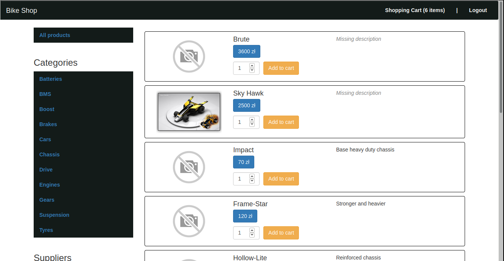
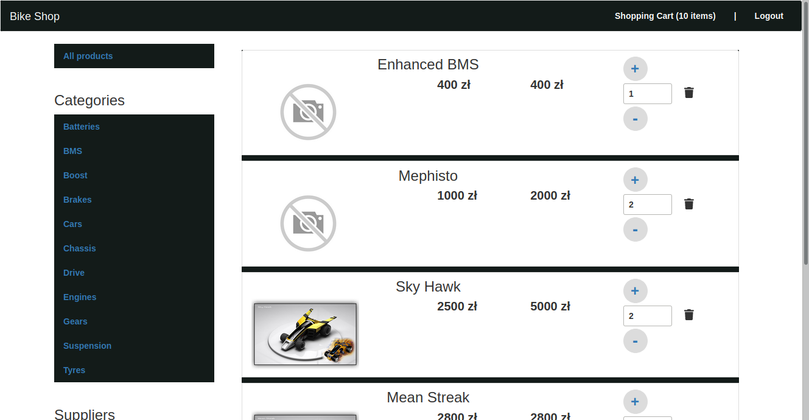

# Codecool Shop - Frontend
This project was generated with [Angular CLI](https://github.com/angular/angular-cli) version 8.3.24.
and currently is being made by

 - [Arkadiusz Szreiber](https://github.com/ArekSzreiber)
 
 and
 
 - [Karol Karpeta](https://github.com/KarolKarpeta) 

It is a frontend part of a [web shop application](https://github.com/ArekSzreiber/CC-Shop-Backend/tree/develop).

## Technologies
 - Angular 8
 - NgRx

## Development server

Run `ng serve` for a dev server. Navigate to `http://localhost:4200/`. The app will automatically reload if you change any of the source files.

## Build

Run `ng build` to build the project. The build artifacts will be stored in the `dist/` directory. Use the `--prod` flag for a production build.

## Further help

To get more help on the Angular CLI use `ng help` or go check out the [Angular CLI README](https://github.com/angular/angular-cli/blob/master/README.md).

## Screenshots

